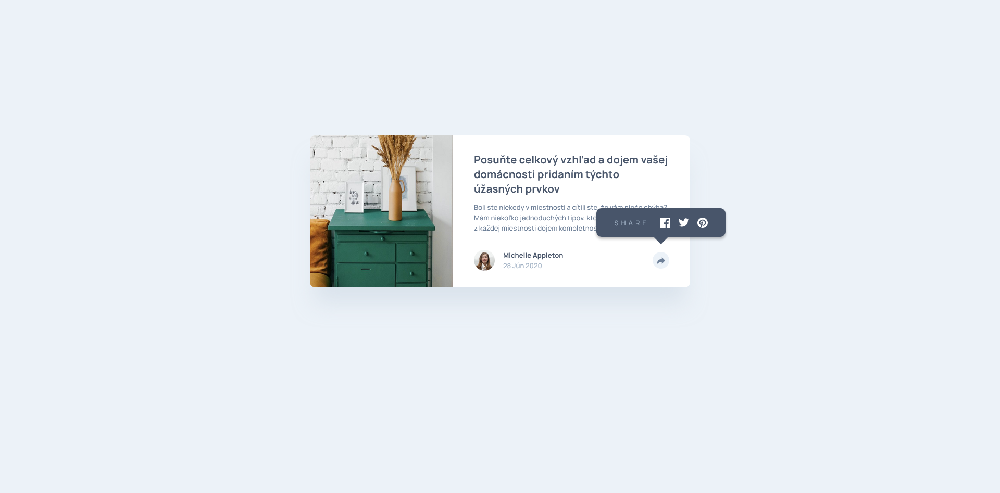
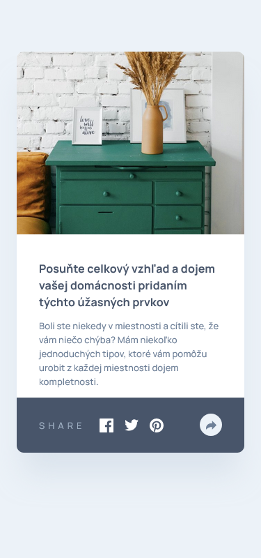

# Frontend Mentor - Article preview component

## 📝 Informácie o projekte

Tento projekt je zo stránky [Frontend Mentor](https://www.frontendmentor.io/challenges/article-preview-component-dYBN_pYFT). Stránka Frontend Mentor ponúka projekty na vypracovanie, ktoré obsahujú základný text v HTML a grafický dizajn projektu. Predlohy projektov sú dostupné vo Figme.

Používatelia tejto stránky môžu:

- prezerať si ju na desktope alebo na mobilnom zariadení
- vidieť možnosti zdieľania po kliknutí na ikonku zdieľania

Po kliknutí na nadpis alebo na meno autorky sa zobrazí môj predchádzajúci projekt zo stránky [Frontend Mentor](https://www.frontendmentor.io/solutions/my-version-intro-component-with-signup-form-mGaz1ESb-k).

#### [Odkaz na hotovú stránku.](https://tomasdunik.github.io/frontend-mentor__article-preview-component/)

 

## 🏗️ Vytvorenie projektu

Projekt som vytvoril za približne 5 hodín. Je to čas od stiahnutia projektu až po jeho finálne publikovanie na stránke Frontend Mentor. Na vytvorenie stránky som použil HTML, CSS, SCSS a JavaScript. Projekt má dizajn pre pre desktop a mobil. Anglické texty z projektu som prepísal na slovenské.

 

## 🛠️ Vytvorené s

- HTML
- CSS
- SCSS
- JavaScript
- Mobile First

 

## 📸 Screenshots

### 💻 Desktop

### 📱 Mobil

 

## 🔗 Projekty Frontend Mentor

- [Tento konkrétny projekt na stránke Frontend Mentor](https://www.frontendmentor.io/solutions/my-version-article-preview-component-zB4uukJR93)

- [Moje ostatné projekty na stránke Frontend Mentor](https://www.frontendmentor.io/profile/WeekendsProgrammer)
